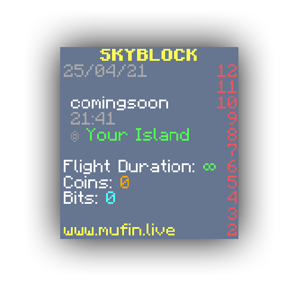
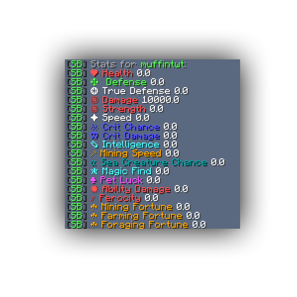

# Hypixel Skyblock Remake

A project where I, mufin, am trying to recrate Hypixel Skyblock in Spigot. There is currently no download available, however you can import the project into your IDE of choice, along with adding the spigot jar as a dependency to export it.

## Current Features

### Utils

This plugin boasts a help menu using the Bukkit `/help` command. To use it, use `/help skyblock` or replace skyblock with any skyblock commands, for example, `/help setcoins`. This will show u a description, the usage and aliases if applicable. The plugin also follows a messaging guideline starting with [SB]. This means that any chat message that doesnt start with that prefix, is from Bukkit, Minecraft or another plugin.

### Playerdata

In the plugin folder there will be a playerdata.yml file. This includes all the data the plugin has about your players. It is layed out as follows. You can edit this file, and when you use the `/skyblock reload` command, the plugin will be able to use this new data.

```yaml
9c3918a4-08f4-40b4-90e9-88e347ef4566:
  name: muffintwt
  displayname: muffintwt
  adress: 000.000.000.000
  level: 0
  location:
    world: world
    x: 6.585169786981329
    y: 100.0
    z: 36.26355428058411
    pitch: 29.2926
    yaw: 257.414
  skyblock:
    coins: 0
    bits: 0
    stat:
      DAMAGE: 0.0
      HEALTH: 0.0
      DEFENSE: 0.0
      TRUE_DEFENSE: 0.0
      STRENGTH: 0.0
      SPEED: 0.0
      CRIT_CHANCE: 0.0
      CRIT_DMG: 0.0
      INTELLIGENCE: 0.0
      MINING_SPEED: 0.0
      SEACREATURESPAWNRATE: 0.0
      MAGICFIND: 0.0
      PETLUCK: 0.0
      ABILITYDAMAGE: 0.0
      FEROCITY: 0.0
      MINING_FORTUNE: 0.0
      FARMING_FORTUNE: 0.0
      FORAGING_FORTUNE: 0.0

```


### Scoreboard

A dynamic scoreboard that includes useful information about the player. This scoreboard is created/reloaded when the player joins or when using the `/scoreboardreload` command.



### Stats

A stats system like in Hypixel Skyblock. The values can be edited in the playerdata.yml file, or using the `/setstat <player> <stat> <value>` command. An overview of your, or another players' stats can be found using the `/stats [player]` command.

